## 📌 프로젝트 소개

> 기존 프로젝트 gitHub 주소  
https://github.com/Team-Roomly

**숙박 및 예약 관련 여행 사이트 입니다.**

본 프로젝트는 IT코리아에서 배운 웹 개발 기술을 활용하여 응용하기 위해 만들어진 프로젝트입니다. 다양한 기능들에 대하여 프론트 및 벡엔드 기술을 실제로 적용하면서 전반적인 웹 개발 과정을 실습하며 배운 기술들을 응용하는것과 실무에서 사용할수 있는 기술들에 초첨을 두었습니다.

**주제 선정 이유**

배운 기술을 응용하고 새로운 API 모듈을 활용하며, 팀원들과 역할이 겹치지 않는 협업을 통해 다양한 경험을 쌓을 수 있는 프로젝트를 고민하던 중, 복합적인 요구사항을 충족해야 하는 여행 및 숙박 예약 사이트가 기술적 성장과 사용자 중심의 서비스 설계를 동시에 경험할 수 있는 최적의 선택이라고 판단하여 선정하였습니다.

## 📌 개발 환경

### IDE & Tools
VS Code:   
Post Man:   
WorkBench: 

### Languages & Framework
---

TypeScript:   
React:   
Java:   
CSS:   
Spring Boot: 

### Database Management System
---

MySql: 

### Version Control & Repository
---

GitHub: 

### 외부 API
---

**결제 포트원**(https://portone.io/korea/ko),
**공공 데이터 포털API**(https://www.data.go.kr/),
**OAuth2 API**(KAKAO, GOOGLE),
**Google 클라우드 지도 api**

## 📌 팀

**안성준(Back-End)**

- 요구사항, API 명세서 작성
- ERD 및 DB 계정 생성 관리
- 게스트 및 관리자 관련 API 구현
- OAuth2 API 연동
- 결제 (포트윈) API 연동 및 구현

**박현우(Back-End)**

- 요구사항 작성
- 호스트및 관리자 관련 API 구현
- ERD 설계
- 사업자 진위 확인 여부 API 연동 및 구현

**이소진(Front-End)**

- 숙소 검색 리스트 / 상세 리스트 페이지 등
- 와이어프레임 작성
- 리액트 라이브러리 활용, 향상된 UI/UX 및 상태관리

**옥진서(Front-End)**

- 회원가입,마이페이지 관련 component 제작
- 마이페이지 및 회원가입 제작
- 프론트 백앤드 연동

**김나연(Front-End)**

- 회원가입 페이지, 아이디/비밀번호 찾기 페이지 구현
- 결제 페이지 구현
- 전체 페이지 CSS

## 📌 시연 영상 및 주요기능 소개

### ✅ ERD

- 총 12개의 테이블로 구성되어 있으며 중복해서 사용하는 테이블은 연두색으로 표시 하였으며, 게스트는 분홍색 호스트는 파란색으로 표시하였습니다.

### ✅ 로그인 및 회원가입 (게스트)

**로그인 및 회원가입시 사용자의 편리를 위해 카카오,구글 연동하였습니다.**

#### 로그인
- 호스트, 게스트 별 로그인 가능하도록 구현하였습니다.  
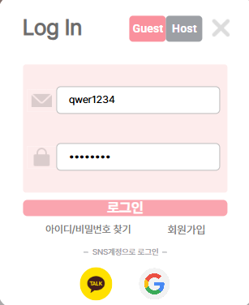
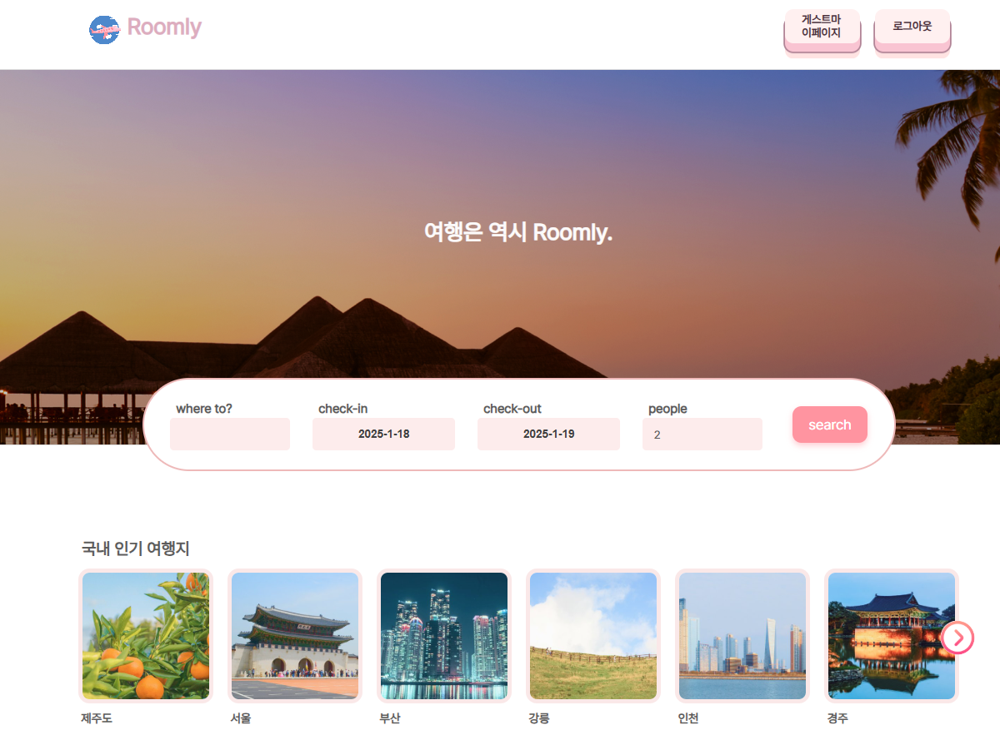
- 로그인 후 메인 페이지 상단 버튼이 로그인/회원가입 -> 마이페이지 / 로그아웃 으로 변경 됩니다.

#### 회원가입
- 아이디 중복확인, 비밀번호 일치여부, 전화번호 중복확인, 인증번호 일치 여부를 통해 회원가입이 가능합니다.  
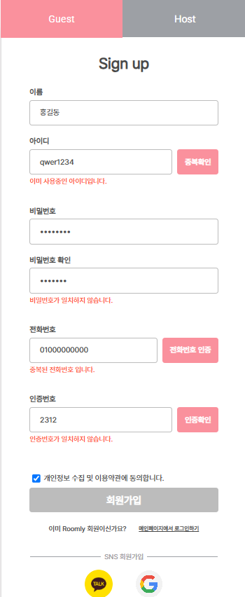  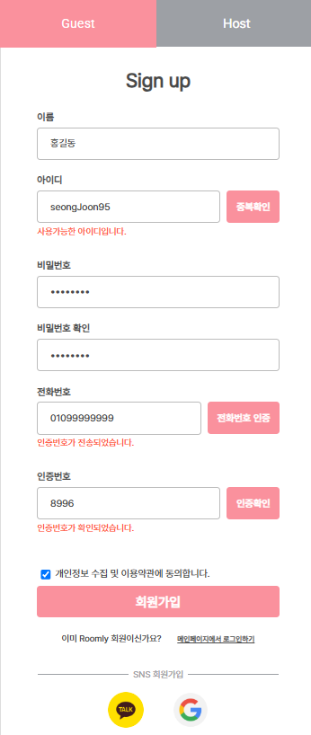

### ✅ 마이페이지 (게스트)
**마이페이지 같은 경우 '내정보관리', '예약내역', '즐겨찾기' 로 나누어 구별할 수 있습니다.**

**내정보 관리**
- 현재 비밀번호를 입력하고 변경할 비밀번호를 입력하여 변경 클릭시 현재 아이디에 대한 비밀번호가 변경되며 강제 로그아웃후 메인창으로 이동하도록 하였습니다.
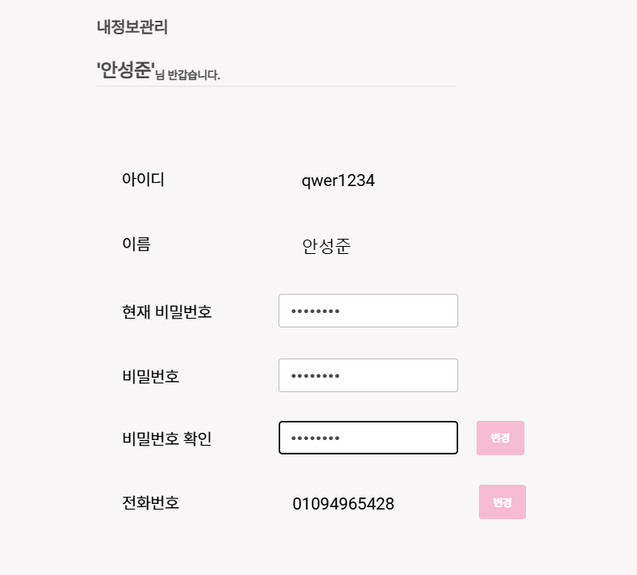  
- 전화번호는 기존의 전화번호를 불러와 보여주며 변경을 클릭하고 새로운 전화번호를 입력하고 중복확인을 거친 후 번호에 대한 인증번호를 입력하고 변경을 클릭하면 로그아웃후 다시 로그인 할수 있도록 하였습니다.  
- 전화번호가 변경되면 데이터베이스에 저장되어 있던 기존의 전화번호를 자동 삭제하도록 하였습니다.
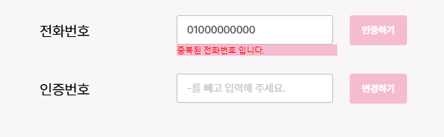
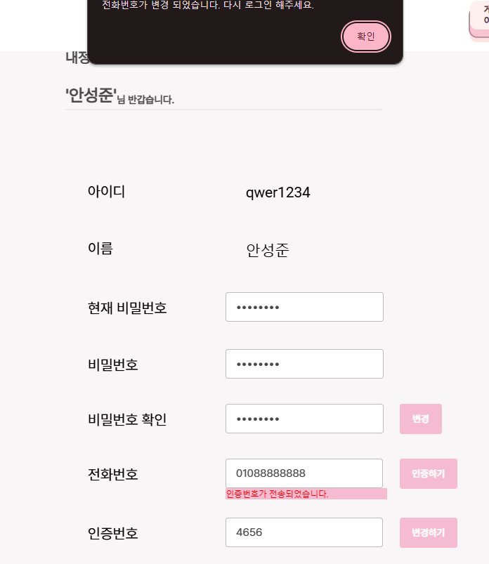

**예약내역**
- 숙소의 객실을 선택 후 결제가 완료되면 해당 숙소에 대한 숙소명, 숙소대표이미지, 호실, 인원수, 입/퇴실 시간과 총금액등을 나타낼수 있도록 하였습니다.
- 해당 숙소에 대한 예약이 되어 있는 상태에서는 리뷰 작성이 가능하며 리뷰작성을 한 경우 해당 숙소의 리뷰 평점에 반영되도록 하였습니다.
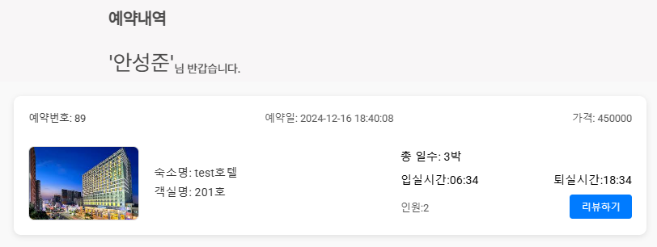
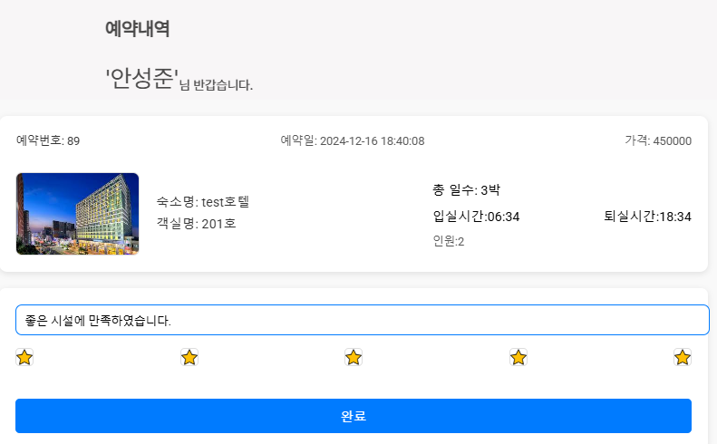

**즐겨찾기**
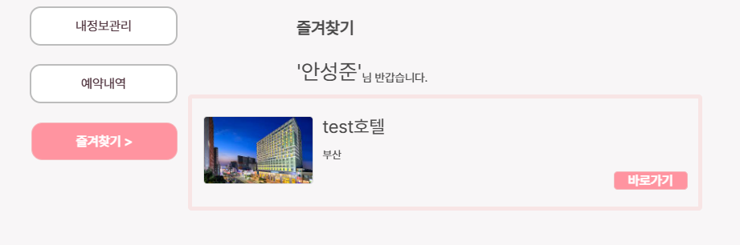

### ✅ 숙소 및 객실 등록하기 (Host)

**숙소 등록**
- 숙소에 관현 정보들을 입력할수 있습니다. 숙소 이미지중 대표 이미지를 클릭하여 대표 이미지로 자동 이미지 변환이 가능합니다.
- 숙소 이미지는 최소 3장 이상 업로드 할수 있습니다.
- 숙소의 종류와 시설에 대해 선택할수 있습니다.
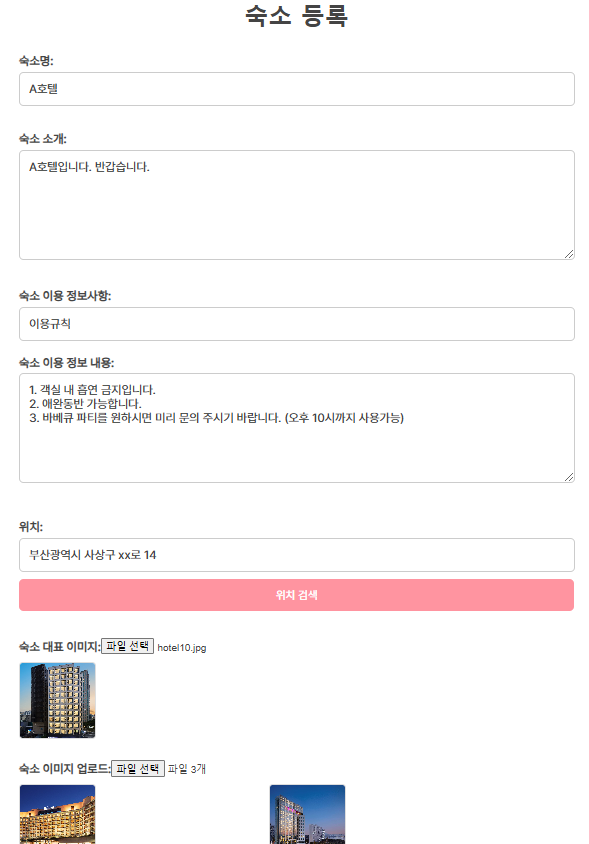
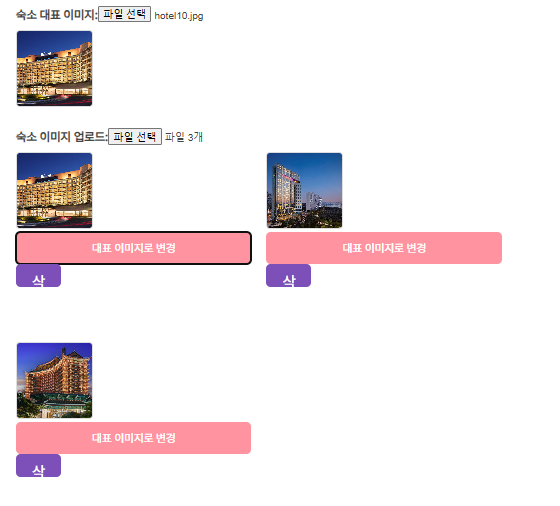

**객실 등록**
- 숙소등록에 대한 업로드가 완료된 후 객실 추가 버튼을 클릭하여 객실을 추가할수 있습니다.
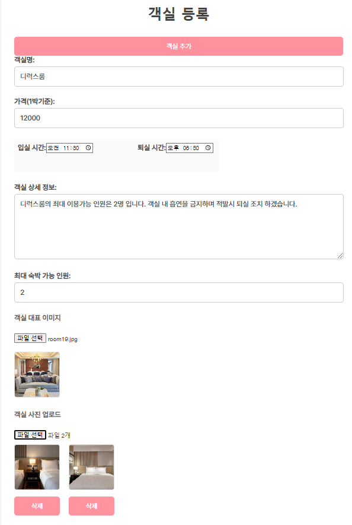

- 관리자의 승인을 받은 호스트에 한해서 숙소 등록할수 있도록 하였습니다.
- 숙소가 등록이 된 상태에서 관리자의 승인이 있어야 게스트가 보는 숙소 리스트에서 등록된 숙소를 확인할 수 있습니다.

### ✅ 결제 기능 구현 

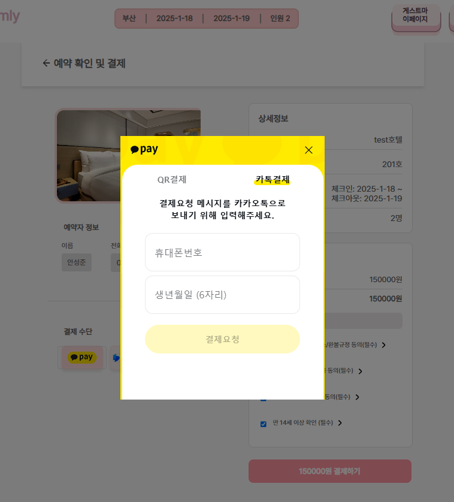

- 메인화면에서 지역과 체크인 체크아웃 날짜, 인원을 검색하면 해당 조건에 부합하는 숙소list를 확인할수 있습니다.
- 원하는 숙소를 클릭하여 숙소상세보기에서 원하는 객실을 선택하여 결제 페이지로 이동합니다.
- 게스트의 이름과 전화번호를 불러오며 다양한 결제 방식을 선택하여 결제 가능합니다.
- 결제후 마이페이지의 예약내역을 확인하면 해당 숙소명과 객실명 입퇴실시간, 가격등을 확인할 수 있으며 리뷰 작성도 가능합니다.

## 📌 상세 내용

### 기능

- **회원가입 및 로그인**
    - **OAuth2**(kakao, naver) **API 연동 및 구현**
    - **파일 업로드 → 폴더에 파일 저장가능(사업자 등록증 이미지 저장시)**
    - **사업자 진위여부 API**
- **회원정보 수정**
    - **게스트**
        - 개인정보 보기 및 수정
        - 리뷰 작성(예약후 가능)
        - 즐겨찾기
        - 내가 작성한 리뷰 list 보기, 예약 현황 보기
    - **호스트**
        - 개인정보 보기 및 수정
        - 숙소등록(승인후) 및 수정
        - 예약 현황보기
    - **관리자**
        - 게스트 정보보기
        - 호스트 정보보기 및 회원가입
        - 숙소등록 승인
- **결제(포트원) API 연동 및 구현**
- **검색기능**
- **필터기능**
    - 지역별 숙소 리스트 출력 가능
    - 카테고리별 숙소 리스트 출력 가능
- 숙소 상세 리스트 및 숙소 안 객실 정보 및 리뷰 구현 가능
- 박수(n박n일)별 객실 이용가격 출력 가능
- 호스트 승인 요청 및 승인된 호스트에 한정 숙소등록 가능

## 프로젝트 결과 및 후기

---

### **안성준**

> **느낀점**
: 이번 프로젝트를 통해 **소통의 중요성**을 다시 한번 깊이 깨닫게 되었습니다. 프로젝트 초반에는 충분히 대화했다고 생각했지만, 서로의 이해가 달라 **의도와 다른 결과물**이 나오는 경우가 종종 있었습니다. 이로인해 **불필요한 시간 낭비**가 발생하기도 했으며, 결과적으로 목표한 기간 내에 프로젝트를 마무리하지 못하는 상황을 겪어야 했습니다. 이러한 경험은 저에게 아쉬움과 동시에 많은 배움을 주었습니다.
앞으로는 프로젝트를 시작하기 전에 **명확한 기준을 설정**하고, 진행 사항과 과정을 팀원 간 말로만 공유하는 것이 아니라 **체계적으로 문서화**해야 한다는 필요성을 확실히 느꼈습니다. 이를 통해 팀 내 **소통 오해를 최소**화하고, 프로젝트의 효율성과 완성도를 높일 수 있을 것이라 믿습니다.

**이슈사항
<문제>:** 프론트와 벡 연동하여 결제 api를 사용하는데 있어서 프론트에서 결제 자체가 되지 않는 문제와 결제가 완료 되어도 벡에 값이 넘어가지 않는 어려움이 있었습니다.

**<해결> :** 해당 라이브러리를 제공해주는 사이트의 공식 문서를 참조하거나 구글 검색 및 chatGPT를 이용하여 문제를 해결 하였습니다. 정말 모르겠던 부분은 강사님께 질문을 통해 알게 되었습니다. 프론트와 벡의 연동되어 있는 부분이 있다보니 개발자 환경도구를 통해 값이 잘 넘어갔는지 error가 발생했는지 파악하고 수정하는 방식으로 문제를 해결하였습니다.

**프로젝트 이후
:** 목표한만큼 마무리 하지 못하였기에 수료가 끝난 이후 저는 제가 맡았던 부분 이외에 다른 부분을 보며 왜 이렇게 코드를 짰는지 이해하게 됫으며, 중복된 코드가 있는 경우 하나의 api로 통일 하며 유지보수과 코드 간결성을 위해 노력하고 있습니다.

